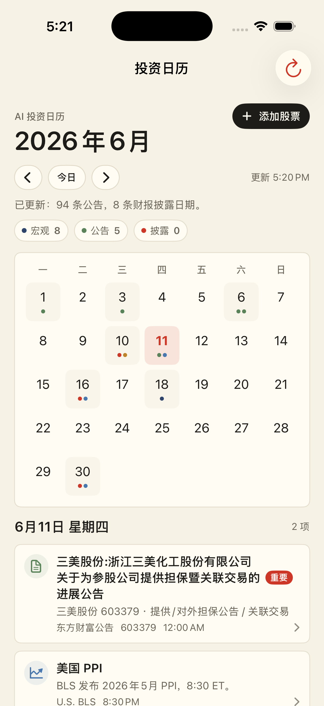

# AI 投资日历

一款为个人投资者定制的 SwiftUI iPhone App，用日历组织宏观经济数据、自选股重大公告和 AI 研判。



## 产品定位

投资信息本身不缺，真正稀缺的是把信息放进正确日期、筛掉低信号噪音，并在事件发生前后提醒投资者重新检查假设。

AI 投资日历把事件分成三层：

- **日历层**：FOMC、CPI、中美主要宏观数据、自选股财报披露日期。
- **重大事项层**：只保留可能改变预期的公司事件，例如重大合同、中标订单、定期报告、业绩预告、分红、重组、停复牌。
- **AI 研判层**：把宏观节点、自选股公告和持仓暴露合并成简洁提示，并标出隐藏集中度。

## 当前功能

- 月历视图：按日期显示宏观事件、公告和披露日期。
- 重大事项：自动过滤担保、关联交易、普通会议材料、月报表等低信号公告。
- 自选股：内置腾讯控股、宁德时代、紫金矿业、洛阳钼业、三美股份，可继续添加 A 股或港股。
- 自动抓取：启动和手动刷新时拉取宏观日程、公告和预约披露日期。
- AI 工作台：包含 AI 研判、AI 联动图谱和 AI 数据源状态。
- AI 数据源：默认本地规则引擎；可配置 Gemini、DeepSeek、Kimi API Key。
- 安全存储：AI API Key 只保存在 iPhone Keychain，不写入源码。

## 数据源

| 模块 | 当前数据源 |
| --- | --- |
| 美联储会议 | Federal Reserve FOMC calendar |
| 美国 CPI / 宏观 | U.S. BLS release calendar |
| 中国宏观 | 国家统计局主要统计信息发布日程 |
| A 股公告 | 东方财富公告接口 |
| A 股预约披露 | 东方财富预约披露 |
| 港股公告 | HKEXnews |
| AI 研判 | 本地规则兜底，可选 Gemini / DeepSeek / Kimi |

网页接口可能随数据源页面结构变化而失效；App 会保留本地规则兜底，不把外部 AI 当作唯一依赖。

## AI 设计

AI 模块目前采用“稳态本地规则 + 可插拔云端模型”的结构：

- 没有 API Key 时：本地规则仍可生成研判、风险提示和联动图谱摘要。
- 配置 Gemini / DeepSeek / Kimi 后：App 会把已抓取的事件摘要发给模型，要求返回结构化 JSON。
- 云端模型失败时：自动回落到本地规则。

不建议把云端 API Key 硬编码进 App。当前实现使用 Keychain 保存个人 Key，适合个人设备使用。

## 架构

```text
InvestmentCalendarApp/
  Models/
    CalendarModels.swift
  Services/
    AIAnalysisProvider.swift
    AnnouncementProviders.swift
    InvestmentCalendarStore.swift
    MacroCalendarProvider.swift
    StockDataProviders.swift
    WebClient.swift
  Views/
    AIProviderSettingsView.swift
    CalendarScreen.swift
    ContentView.swift
    WatchlistView.swift
```

核心思路：

- `InvestmentCalendarStore` 统一管理日历事件、自选股、刷新状态和 AI 研判结果。
- `AnnouncementProviders` 负责 A 股 / 港股公告抓取和低信号公告过滤。
- `AIAnalysisProvider` 封装本地规则、Gemini、DeepSeek、Kimi 四种 AI 来源。
- SwiftUI 页面保持轻量，只消费 store 的结构化状态。

## 构建

需要：

- macOS + Xcode
- XcodeGen
- iPhone 开发者模式
- Apple Developer Personal Team 或正式开发者账号

生成工程：

```bash
cd /Users/andyyu/InvestmentCalendarApp
xcodegen generate
```

模拟器构建：

```bash
xcodebuild \
  -project InvestmentCalendar.xcodeproj \
  -scheme InvestmentCalendar \
  -destination 'generic/platform=iOS Simulator' \
  -derivedDataPath build \
  build
```

真机构建：

```bash
xcodebuild \
  -project InvestmentCalendar.xcodeproj \
  -scheme InvestmentCalendar \
  -destination 'id=<你的 iPhone UDID>' \
  -derivedDataPath build-device \
  -allowProvisioningUpdates \
  -allowProvisioningDeviceRegistration \
  build
```

安装到已连接 iPhone：

```bash
xcrun devicectl device install app \
  --device <你的 iPhone UDID> \
  build-device/Build/Products/Debug-iphoneos/InvestmentCalendar.app
```

## 发布状态

当前版本是个人定制开发版，已在真实 iPhone 上完成 Debug 包安装验证。后续进入 App Store 前，还需要补充：

- 隐私说明和免责声明的 App 内展示。
- 后台刷新或通知策略。
- 数据源稳定性监控。
- App Store 截图、关键词、审核文案。
- 正式 bundle id、图标和发布签名。

## 免责声明

本项目只用于投资日历、信息聚合和个人研究辅助，不构成投资建议、交易建议或收益承诺。数据来自公开网页和第三方公开接口，可能延迟、缺失或被页面结构变化影响；重要投资决策应以交易所、上市公司公告和官方统计机构原文为准。

## License

No open-source license has been selected yet. All rights reserved by default.
